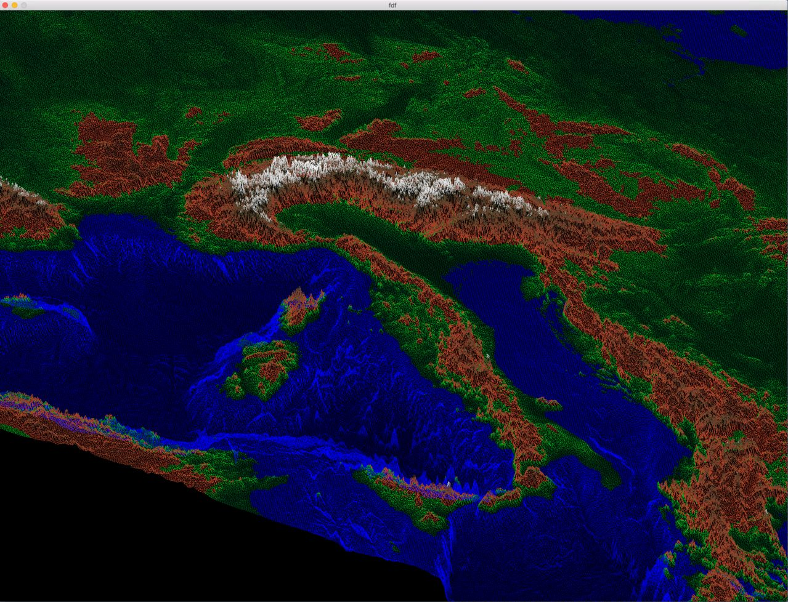

# fdf
Get a visual representation of your topographic data.

You can use any data array you wish.

Only works on OSX.

First, run :

<code>make</code>

Then, for example :

<code>./fdf 42.fdf</code>

Keys :

  - Move around                     : W, A, S, D
  - Move view                       : Arrow keys
  - Zoom in/out                     : Z / X
  - Change colors                   : F
  - Change viewmode                 : M
  - Change altitude of a point      : left/right click
  - Change general height of points : J / H

